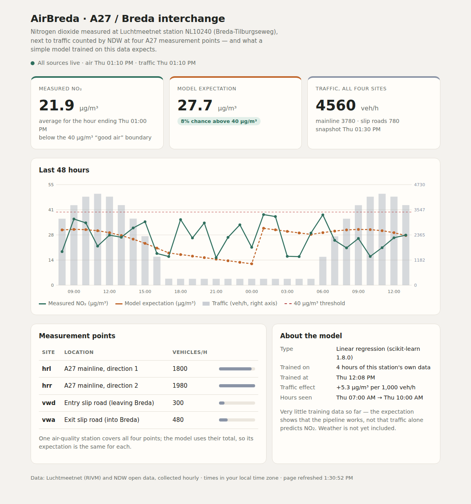
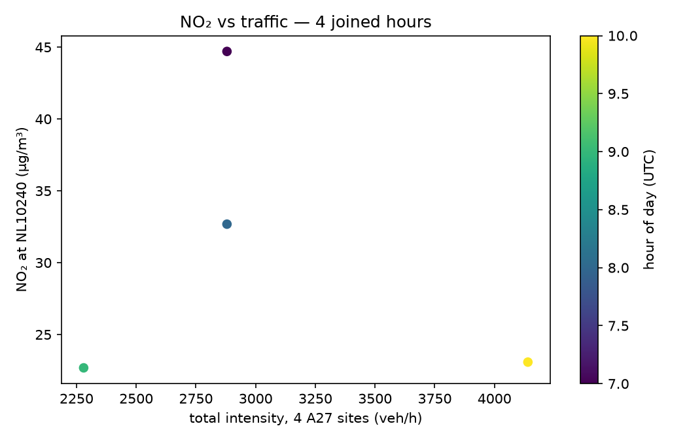

# AirBreda

AirBreda is a small cloud data pipeline. Every hour it collects **NO₂ air quality** from Luchtmeetnet station **NL10240** (Breda-Tilburgseweg) and **A27 traffic** from four NDW measurement sites near the Breda interchange. It stores the data, joins it by hour, trains a simple regression model and shows the result on a web dashboard.

> **Honest status:** the pipeline and deployment work. The model does **not**: it is trained on 25 hours of data and explains almost none of the variation in NO₂ (R² 0.08). See [Model limits](#model-limits).



## How it works

```
Luchtmeetnet API ─► airbreda-air ──────┐
                                       ├─► RDS PostgreSQL (clean readings)
NDW open data ───► airbreda-traffic ───┤
                                       └─► S3 (hourly CSVs + raw feeds)
                                                  │
                  laptop: build_training_data.py → train_model.py → model.pkl
                                                  │
                         dashboard (FastAPI, model baked into the image)
```

- **Cloud:** AWS, region `eu-north-1` (Stockholm): one EC2 `t3.micro`, RDS PostgreSQL, one S3 bucket.
- **Scheduling:** cron on the VM starts `airbreda-air` (minute :10) and `airbreda-traffic` (minute :20). Each runs once and exits.
- **Dashboard:** a third, long-running container (`docker run -d --restart unless-stopped`).
- **Access:** the VM reaches S3 through an IAM instance role (`s3:PutObject`, `s3:GetObject` only), so no AWS keys are stored on the VM.

The full design, with the six decision records (ADR-001 to ADR-006), the trust boundaries and the cost estimate, is in the **[Architecture Design Document](docs/index.md)**.

## Data sources

| Source | What | Notes |
|---|---|---|
| [Luchtmeetnet](https://api-docs.luchtmeetnet.nl/) (RIVM) | Hourly NO₂ at station NL10240, in µg/m³ | No API key; fair use 100 requests / 5 minutes |
| NDW open data | Traffic flow (vehicles/hour) and speed (km/h) for four A27 sites: `hrl`, `hrr` (mainline), `vwd`, `vwa` (ramps) | Two gzipped XML feeds: configuration and live measurements |

Data-quality rules: a null or stale NO₂ value is **kept and flagged**; an NDW speed of `-1` (no measurement) is **dropped and logged**. Duplicate readings are ignored with `INSERT … ON CONFLICT DO NOTHING`.

## Repository layout

| Path | Purpose |
|---|---|
| `getNO2Readings.py`, `getTrafficReadings.py` | Course extract scripts: fetch the latest NO₂ value and parse the NDW feeds |
| `ingest_air.py`, `ingest_traffic.py` | Ingestion jobs: retry, quality checks, write to PostgreSQL and S3 |
| `scheduler.py` | Runs a job once (default, for cron) or in a loop (`RUN_MODE=loop`, for Compose) |
| `quality.py` | Structured JSON logging, `/health` data, bad-data counts |
| `publisher.py` | Optional Redis queue (off unless `QUEUE_ENABLED=1`; not used on the VM) |
| `db.py`, `create_table.py`, `check_db.py` | Database connection, table creation, helper check |
| `build_training_data.py` | Joins NO₂ rows (database) with traffic CSVs (S3) into `training_data.csv` |
| `train_model.py` | Trains the regression, writes `model.pkl` and `model_meta.json` |
| `predict.py` | `predict()`: predicted NO₂ and exceedance risk |
| `dashboard.py` | FastAPI app: `/`, `/site/{id}`, `/health` |
| `Dockerfile`, `Dockerfile.traffic`, `Dockerfile.dashboard` | Container images |
| `docker-compose.yml`, `docker-compose.day2.yml` | Local multi-container runs |
| `airbreda-s3-policy.json` | IAM policy for the S3 bucket |
| `tests/` | Automated tests (34 pass) |
| `docs/` | Architecture Design Document (GitHub Pages) |

## Getting started (local)

**Requirements:** Python 3.12, Docker, an AWS account, a PostgreSQL database.

```powershell
python -m venv .venv
.venv\Scripts\activate
pip install -r requirements.txt
copy .env.example .env      # then fill in your own values; never commit .env
pytest -q
```

Configuration lives in `.env` (see `.env.example` for the variable names; database settings start with `DB_`). **Do not commit `.env`.**

**Build the images**

```powershell
docker build -t airbreda-air -f Dockerfile .
docker build -t airbreda-traffic -f Dockerfile.traffic .
docker build -t airbreda-dashboard -f Dockerfile.dashboard .
```

**Train the model** (after some hours of data have been collected)

```powershell
python build_training_data.py
python train_model.py
```

Then rebuild `airbreda-dashboard` so the new `model.pkl` is baked into the image.

## Dashboard API

| Route | Returns |
|---|---|
| `GET /` | HTML page with the latest NO₂, predictions and total traffic |
| `GET /site/{id}` | For `hrl`, `hrr`, `vwd`, `vwa`: latest NO₂, traffic intensity, predicted NO₂ and exceedance risk. If `predict()` fails, it still returns HTTP 200 with the measured values and `null` predictions |
| `GET /health` | Last successful fetch and bad-data counts per source, and whether the model is loaded |

## Model limits

- **Training data:** 25 joined hours (1 Oct 00:00 to 2 Oct 06:00 UTC), saved in `training_data.csv`.
- **Result:** in-sample R² 0.08; MAE 7.24 µg/m³ against 7.77 for always predicting the mean. The traffic coefficient is slightly negative. This does not mean traffic lowers NO₂: weather is not in the model and the sample is tiny.
- **Exceedance risk** is a sigmoid centred on 40 µg/m³ and never rises above about 0.2. **Do not use the predictions for decisions.**
- A logistic model (`model_logistic.pkl`) was also trained but is not used for serving.



## Known gaps

The database is publicly reachable (for development), the containers use the database master user, the dashboard is open on port 8000 over HTTP without authentication (for assessment only), and there is no failover or infrastructure-as-code yet. These are listed with their reasoning in the [design document](docs/index.md).

## Data and credits

Air quality data: RIVM / Luchtmeetnet. Traffic data: NDW open data. Course project for a cloud data engineering elective.
