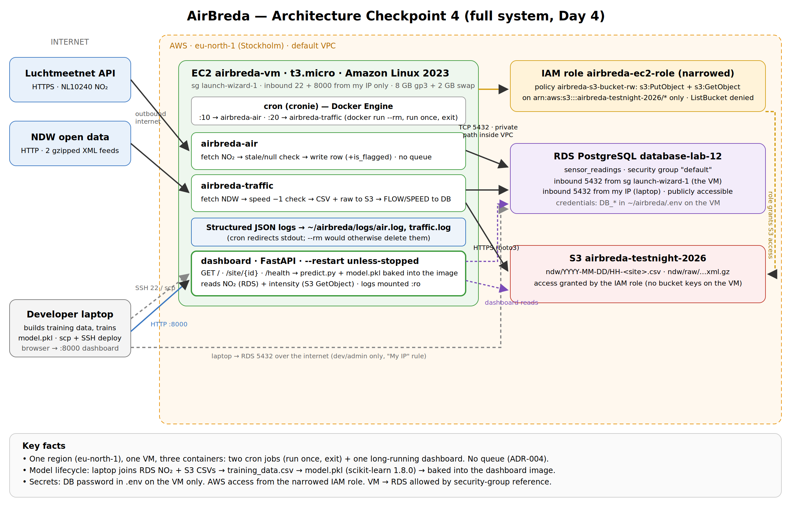

# AirBreda — Architecture Design Document

*Correlating NO₂ at Luchtmeetnet station NL10240 (Breda-Tilburgseweg) with traffic at the A27 / Breda interchange.*
*Cloud provider: AWS, region eu-north-1 (Stockholm). State of the system: 1 October 2026, as deployed.*

---

## 1. Architecture as deployed

**Data flow.** Every hour, cron on one EC2 VM starts two short-lived containers. `airbreda-air` (minute :10) fetches the latest NO₂ value from the Luchtmeetnet API, checks it for null or frozen values, and writes it to PostgreSQL. `airbreda-traffic` (minute :20) downloads NDW's two national traffic feeds, extracts four A27 measurement sites (`hrl`, `hrr` mainline; `vwd`, `vwa` ramps), stores one CSV per site plus the raw feeds in S3, and writes flow/speed rows to PostgreSQL. A third, long-running `dashboard` container serves a JSON API (`/site/{id}`, `/health`) and an HTML page; it reads NO₂ from the database, traffic from S3, and calls a linear regression model that is baked into its image. The model is trained on a laptop from the same database and bucket.

**Trust boundaries — who can access what**

| Principal | Can access | How it is authorised | Cannot |
|---|---|---|---|
| EC2 instance (role `airbreda-ec2-role`) | S3 objects in `airbreda-testnight-2026`: `s3:PutObject`, `s3:GetObject` | Custom IAM policy on `arn:aws:s3:::airbreda-testnight-2026/*`; temporary credentials from instance metadata — no keys on the VM | List the bucket (verified: *AccessDenied*), any other bucket or AWS service |
| Containers on the VM → database | PostgreSQL on port 5432 | Network: RDS security-group rule whose source is the VM's security group. Identity: DB user/password in `.env` on the VM | — (see risk below) |
| Developer laptop (IAM user `airbreda-dev`) | Everything in the account; RDS port 5432; SSH to the VM | `AdministratorAccess`; "My IP" security-group rules; SSH key pair | — |
| Browser (my IP only) | Dashboard on port 8000 | VM security group inbound rule from one IP, plain HTTP | Anything else on the VM |
| Luchtmeetnet, NDW | — | The VM only makes **outbound** requests to them | — |

**Known gaps in these boundaries** (addressed in §6): the database is still *publicly accessible* (for laptop access), the containers use the database **master** user, the laptop user has administrator rights, and the dashboard uses HTTP without authentication.

**Verified behaviour.** Cron runs unattended (11:10 / 11:20 UTC runs logged `db_write_success`); after narrowing the IAM role the traffic job still uploaded 6 objects and the dashboard still read intensities from S3, while `aws s3 ls` was denied; the dashboard is reachable at `http://<vm-ip>:8000`; 32 automated tests pass.

---

## 2. Architecture Decision Records

### ADR-001 — Initial Data Storage Strategy (Day 1)

**Context.** AirBreda ingests two sources: hourly NO₂ averages (one value per hour) and NDW traffic (two gzipped DATEX II XML feeds, ~1.5 MB and ~0.7 MB compressed per download). Readings are highly structured — `(station_id, timestamp, component, value)` — and the core questions are time-range queries ("NL10240 between A and B") and **joins** between air quality and traffic. Volume is small: 11 hourly series ≈ 96,000 rows/year; even 10 stations for 5 years is under 5 million rows. Ingestion is at-least-once: a script may run twice for the same hour. And the parser will change, so history must be re-derivable.

**Decision.** Parsed readings go into **PostgreSQL on Amazon RDS** (`sensor_readings`, primary key `station_id, timestamp, component`). Raw files go into **S3**: one CSV per NDW site per hour (`ndw/YYYY-MM-DD/HH-<site>.csv`) and the gzipped raw feeds (`ndw/raw/…`). Duplicates are absorbed by **idempotent writes** (`INSERT … ON CONFLICT DO NOTHING`), not by exactly-once delivery. All timestamps are UTC; files are named by **measurement** time, not run time. Null values are stored as NULL, never dropped or invented.

**Why.** A relational database fits the fixed schema, indexes the time-range queries through the primary key, and does joins natively; NoSQL's advantage — horizontal write scaling — solves a problem 96,000 rows/year does not have. Object storage is cheap and durable for files and keeps an unmodified audit trail: when the parser changes, the raw feeds can be re-parsed into a corrected training set — the database only holds what the old parser extracted. Idempotent writes make duplicates harmless at a fraction of the complexity of exactly-once delivery; this was later proven when a laptop stack and the VM ran simultaneously and the duplicates were silently absorbed (`rows_already_present` in the logs).

**Consequences.** Simple, cheap, queryable; safe re-runs; reprocessable history. But `DO NOTHING` keeps the **first** value forever: if a source later corrects a reading, the correction is ignored. Two stores must be kept consistent, and the NDW site IDs (27 characters) later forced a schema change (`station_id` widened from `VARCHAR(20)` to `VARCHAR(40)`). Rejected alternatives: DynamoDB (no joins, keys designed up front, AWS-only), database-only (raw data lost), files-only (no efficient queries).

### ADR-002 — Messaging Architecture (Day 2)

**Context.** The roadmap adds consumers of every reading — a database writer, ML inference, perhaps an anomaly detector. Wiring each one into the ingestion scripts means changing both producers for every new consumer, and a slow consumer could block ingestion. Volume is tiny: about 5 messages per hour (≈ 3,650/month).

**Decision.** Ingestion services **publish each reading as JSON to a message broker**, alongside (not instead of) their storage writes. For the Day 2 lab the broker is **Redis** (a list `readings`) in Docker Compose. For production the plan is **Amazon SNS → SQS**, one queue per consumer. Publishing is best-effort: a broker failure is logged (`queue_publish_failed`) and the run continues.

**Why.** A broker decouples producers from consumers and isolates failures. Redis was chosen for speed of learning — one container, no cloud setup — but it is a weak production broker for AirBreda: a Redis **list is a queue, not a topic**, so two consumers would *split* the readings instead of each receiving all of them; durability is limited to periodic snapshots (the default config saved after "1 changes in 3600 seconds"), and the queue was lost when its container was removed. SNS → SQS provides fan-out, durability and dead-letter queues without servers to run, at negligible cost for ~3,650 messages/month.

**Broker down?** Storage writes still happen, so **no reading is lost from the database or bucket**; the queue simply misses those messages, because there is no retry or outbox. A future fix is the *transactional outbox* (write the message in the same transaction as the reading; relay later).

**Flag versus drop.** Luchtmeetnet null/stale values are **kept and flagged** (`is_flagged = TRUE`): for a time series a visible flagged value beats a silent gap. NDW `speed = −1` sentinels are **dropped** from the database (the raw feed stays in S3) so that averages are not corrupted. If starting over, I would apply **keep-and-flag to both**, storing the sentinel as NULL: dropping creates a gap indistinguishable from "no data", and night-time ramps with zero vehicles may legitimately report no valid speed.

**Consequences.** Adding consumers no longer touches producers; but two delivery paths can diverge, every consumer must be idempotent, and the Redis list grew unbounded because nothing consumed it. *Partly superseded by ADR-004 for the VM deployment.*

### ADR-003 — Resilience Strategy (Day 2)

**Context.** The December 2021 AWS us-east-1 event showed that a whole region can be impaired for hours. AirBreda runs in one region with one database and no cross-region copy. It is an informational dashboard: an outage harms nobody directly, because official RIVM data remains available elsewhere — but a long outage makes the product useless. Lost NO₂ hours can be backfilled from the Luchtmeetnet API; lost NDW data cannot, because NDW publishes only the current snapshot.

**Decision.** **SLO for `/site/{id}`: 99.5 % availability** over 30 days (SLI: non-5xx responses within 2 s), giving an **error budget of 216 minutes/month**. Secondary SLI: the NO₂ value served is less than 2 hours old. **DR tier: Pilot Light** — data kept live in a recovery region (RDS cross-region read replica in eu-west-1, S3 cross-region replication), compute switched off; targets RTO ≤ 1 hour, RPO ≤ 5 minutes.

**Why.** 99.9 % (43 min/month) would require multi-region failover faster than the data even changes (hourly). 99 % (7.2 h/month) tolerates a full working day of downtime. Backup & Restore cannot meet 99.5 %: one regional incident with a multi-hour restore consumes the whole monthly budget. Warm Standby (course suggestion) keeps compute running in a second region to save perhaps 30–45 minutes of recovery, costing **≈ $27/month more** than Pilot Light (≈ $12–15) — roughly 3× the DR spend for little user benefit.

**Consequences.** Survives a regional failure within the SLO on paper; failover is a manual runbook that must be **tested**, or the RTO is fiction. **This ADR is a target, not the current state**: today there is no replica, and the single VM (ADR-004/005) cannot meet 99.5 % on its own.

### ADR-004 — Compute Strategy (Day 3)

**Context.** The ingestion containers ran on a laptop, which sleeps and changes networks. They had to run 24/7 next to the database and bucket. Workload: two jobs per hour, seconds to a minute each.

**Decision.** One **EC2 t3.micro** VM (Amazon Linux 2023) in **eu-north-1** — the same region as RDS and S3, although the lab suggested a new bucket in eu-west-1 (both are EU regions; splitting would add latency, cross-region charges and a second region dependency). **cron** starts each job as a fresh container (`docker run --rm`) that runs once and exits; output is appended to log files. S3 access through an **IAM instance role**, database access through a **security-group reference**. **No message broker** in this deployment.

**Why a VM.** It exposes the IaaS layer the course is about (OS, packages, cron, permissions), runs the existing images unchanged, and costs a predictable **≈ $12/month** (instance $7.88, public IPv4 address $3.65 — easy to miss, ≈ 30 % of the cost — and disk $0.64). **Why the queue was dropped:** there is no consumer; it would be another process to keep alive on a 1 GiB VM; and run-once containers on one VM have nothing to decouple from. It returns with a second consumer, with ingestion outgrowing one VM, or with a need to buffer during database outages — as SNS → SQS, not Redis.

**Unanticipated operational concern.** The traffic job, fine on the laptop, was **killed silently for lack of memory** on the 1 GiB VM: its log stopped after one line, no error, and `--rm` removed the container and its exit code. Diagnosis (`curl` showed the NDW download took 0.2 s; no container left; no swap) led to a 2 GiB swap file. The run also showed **~12 s of parsing per site**, because the code re-reads the whole XML for each site. Related surprises: cron was not installed on Amazon Linux 2023; Day 2's looping containers would never exit under cron (one stuck container per hour) — fixed by making run-once the default.

**Consequences.** Runs independently of the laptop with no AWS keys on the VM; but we now patch an OS, logs live on one disk, nothing alerts on a missing run, and the VM is a single point of failure.

### ADR-005 — Compute & Deployment Strategy (Day 4) — *extends ADR-004*

**Context.** Day 4 adds a dashboard/API that must answer requests at any time, unlike the batch jobs. It needs the model, the database and the bucket — all already reachable from the VM.

**Decision.** Run the dashboard as a **third container on the same VM**, long-running with `docker run -d --restart unless-stopped`, port 8000 open to one IP. Test the three-container setup locally with **Docker Compose** against the real cloud database and bucket before deploying with `scp` + `docker build`. Narrow the IAM role to `PutObject`/`GetObject` on the bucket.

**Why.** Zero marginal cost on an already-paid VM, all network paths and permissions already in place, and a trivial load (one user, four API calls every 5 minutes, 60-second cache). **What would change my mind:** real users (one VM in one AZ cannot honestly deliver ADR-003's 99.5 %), public access (needs HTTPS and authentication), memory pressure (the VM already needs swap), or frequent deployments by several people (CI/CD to a registry and a managed service such as ECS on Fargate).

**Reboot behaviour.** Docker and crond are enabled at boot; the dashboard returns through its restart policy; the ingestion jobs resume at the next :10/:20; swap returns via `/etc/fstab`. A *stop/start* (not a reboot) changes the public IP. Configured, not yet tested with a real reboot.

**What local Compose caught.** Honestly: nothing — it worked first time. Its value was confirming that the image builds, the model loads in the container and `.env` reaches RDS and S3. It could not catch the two things that differed in the cloud: the VM's security group had no rule for port 8000 (the dashboard answered `curl localhost:8000` on the VM but not the browser), and the VM uses a narrowed role where the laptop used broad personal keys. Two defects in the provided Dockerfile (a multi-file `COPY` without a trailing `/`, and Python 3.11 vs. the 3.12 used for training) were caught by reading it.

**Extends, not supersedes.** Nothing in ADR-004 was reversed; added are a long-running container, port 8000, the narrowed IAM policy and swap as a documented requirement.

**Consequences.** One VM now carries both batch and serving; any VM failure takes everything down.

### ADR-006 — ML Serving Architecture (Day 4)

**Context.** Training data is the exhaust of the pipeline: NO₂ rows from the database joined to traffic CSVs from S3. Join rule: the traffic file for hour *HH* ↔ the NO₂ row stamped *HH+1*, because a Luchtmeetnet value is the average of the hour **ending** at its timestamp, and the NDW file is a snapshot taken **during** hour HH ("round to the nearest hour" would join traffic to the hour before it happened). Flagged rows and incomplete hours are excluded. Result: **4 joined hours** (07–10 UTC, 1 Oct 2026). Traffic cannot be backfilled, so only time adds rows (~1 per hour).

**Decision.** A **linear regression** on `total_intensity_veh_per_hr` (sum of the four sites) and `hour_of_day` (UTC), saved as `model.pkl` (scikit-learn **1.8.0**, pinned) and **baked into the dashboard image**; `predict()` is called in-process. **Exceedance risk** = sigmoid centred on **40 µg/m³** with steepness 0.2. If `predict()` fails, `/site/{id}` **degrades**: HTTP 200 with the real NO₂ and intensity, prediction fields `null`, and a `prediction_error` message.

**Why a linear model.** Fitted model: *NO₂ = 92.61 + 0.00529 × traffic − 9.17 × hour*. In-sample R² = 0.985 and MAE = 0.91 µg/m³ (baseline MAE 7.91) are **meaningless**: 4 rows and 3 parameters leave one degree of freedom. The traffic coefficient has the expected positive sign (+5.3 µg/m³ per 1,000 veh/h); the hour coefficient is an artefact of a 4-hour morning decline. On the live dashboard at 12 UTC it predicted **6.7 µg/m³ against 21.9 measured** — extrapolation outside the training hours. A more flexible model would memorise these four points even more and explain itself less; the linear model fails visibly and its coefficients exposed the artefact immediately. It would take weeks of data covering all hours, weekdays and weather, plus a time-based hold-out on which the linear model beats the mean, before a more complex model could be judged.

**Why 40 µg/m³ and a sigmoid.** The EU hourly limit (200 µg/m³) is never approached at NL10240 (15–45 observed), so risk would always be ≈ 0; the EU annual limit (40, falling to 20 in 2030) and WHO guidelines (10 annual, 25 daily) are averages, not hourly thresholds. 40 µg/m³ is the upper edge of the "good" class for hourly NO₂ in the European air-quality classification. A logistic classifier was not trained: only 1 of 4 hours exceeded 40.

**Training-serving skew.** It would appear if serving computed features differently: one site's intensity instead of the four-site total (so `/site/{id}` predicts from the total and all sites show the same prediction), local time instead of UTC, or a different scikit-learn version unpickling the model. Baking the model into the image makes **code + model + library versions one immutable unit**: no newer `model.pkl` can appear under code not written for it, nothing retrains live on unvalidated data, and rollback is "run the previous image".

**One station for four sites.** All four sites are inputs at one interchange next to one measured target; nothing is estimated for a place without a sensor. A second interchange would need its own nearby station, because NO₂ falls off steeply with distance from a road and depends on wind, and there would otherwise be no ground truth to train or check against.

**Why degrade on failure.** The measured values are the trustworthy part of the response and come from working stores; the prediction is the least reliable component. Failing the whole request would hide good data because of the weakest part.

**Consequences.** One container, no model server, reproducible serving; but every retrain needs rebuild and redeploy, and the current model is misleading outside 07–10 UTC (backlog: an `extrapolating` flag, retraining on weeks of data, weather and cyclic-time features).

---

## 3. Trade-off justifications

**Storage — relational database + object storage.** I considered a single NoSQL store (DynamoDB), a single relational database, and files only. I chose PostgreSQL for parsed readings and S3 for raw files, because AirBreda's ~96,000 rows/year are tiny, fully structured and must be joined (NO₂ × traffic), while the raw NDW feeds (~2.2 MB compressed per hour, ~1.6 GB per month) are the only way to re-derive history after a parser change. I gave up operational simplicity — two stores to keep consistent, an RDS instance that costs ≈ €15/month even when idle — and the "infinite scale" of NoSQL, which this workload will not need even at 50 corridors (≈ 3.5 million rows/year at hourly resolution).

**Compute — one VM with cron.** I considered serverless functions, ECS on Fargate and a VM. I chose a t3.micro VM because it runs the existing containers unchanged for ≈ €10.60/month, and the workload is two jobs of under a minute per hour plus a one-user dashboard. I gave up availability (one VM, one AZ — incompatible with a 99.5 % SLO), automatic patching and scaling, and some memory headroom: 1 GiB required a swap file before the traffic job would finish, and per-site parsing takes ~12 s, so 50 corridors (200 sites) would need ~40 minutes per hourly run unless the parser is rewritten.

**Messaging — queue on Day 2, direct writes on Day 3.** I considered direct writes, a Redis list, and SNS → SQS. Day 2 used Redis to learn decoupling; from Day 3 the VM writes directly, because at ~5 messages/hour and zero consumers a broker is pure operational surface. I gave up the ability to add consumers without touching producers and to buffer during database outages; I would bring back a durable managed broker (SNS → SQS, negligible cost at 3,650 messages/month) as soon as a second consumer appears.

**DR — Pilot Light.** I considered all four AWS tiers against a 99.5 % SLO (216 minutes of error budget per month). Backup & Restore (< $1/month) cannot recover within budget; Warm Standby (≈ $40/month) and Active-Active (≈ 2× production) buy minutes of recovery for a dashboard whose data changes hourly. Pilot Light (≈ $12–15/month for a replica and replicated storage) meets an RTO of ≤ 1 hour. I gave up fast failover and accept a manual, still untested, runbook — and NDW data during an outage is lost, since NDW keeps no history.

---

## 4. Why AWS — for the Municipality of Breda

*For a policy officer, not an engineer.*

AirBreda collects two kinds of public information every hour: air-quality measurements from the national monitoring network and traffic counts from the national traffic data service. It stores them, compares them, and shows the result on a web page. We rent the computers, storage and database that do this from Amazon Web Services (AWS), one of the largest cloud providers.

**What AWS gives us.** We pay only for what we use — about €26 a month today — instead of buying and maintaining our own servers. AWS runs the database for us, keeps copies of the stored files, and lets us grow from one road junction to fifty without changing the design. Access is tightly controlled: the program that collects data may only add and read files in one storage area, and nothing else.

**Why it is appropriate for a Dutch public body.** All our data is stored inside the European Union, in AWS's Stockholm data centres, so European privacy law applies. The data itself is low-risk: it is already public, and it contains no personal information about residents. Still, AWS is an American company, and some governments worry that American law could give US authorities a claim on data held by US companies. For more sensitive future uses, AWS now offers a separate European Sovereign Cloud that is fully located within the EU and physically and logically separate from its other regions, with smaller sites planned in Belgium, the Netherlands and Portugal. The municipality should weigh this against its own information-security rules (the government baseline known as BIO) before scaling up.

**What we would lose by switching.** The programs themselves are packaged in a portable way and would run elsewhere. Switching to another provider — for example Microsoft Azure, which has a data centre in the Netherlands, or a European provider — would mean rebuilding the access rules, the database and the storage setup, roughly several days of specialist work, plus a period of running both systems in parallel. We would also lose the documentation and experience built up so far. The decision is reversible, but not free.

---

## 5. Cost estimate (AWS, eu-north-1, on-demand)

| Component | Current (1 corridor) | At 10 corridors | At 50 corridors |
|---|---|---|---|
| Compute (VM) | €10.59 | €17.45 | €32.00 |
| Database | €15.51 | €15.51 | €26.40 |
| Object storage | €0.22 | €0.33 | €0.84 |
| **Total** | **€26.32 / month** | **€33.30 / month** | **€59.24 / month** |

**Assumptions** (730 h/month; USD → EUR at 0.87 — update to the current rate; hourly ingestion in all columns; each extra corridor = 4 NDW sites + one more public Luchtmeetnet station at no data cost):

- **Compute.** Current: t3.micro $0.0108/h + public IPv4 $0.005/h + 8 GB gp3. 10 corridors: **t3.small** (2 GiB, $0.0216/h), so the traffic job no longer depends on swap. 50 corridors: **t3.medium** ($0.0432/h) + 20 GB disk.
- **Database.** db.t4g.micro ($0.016/h) + 20 GB storage (≈ $0.125/GB) + public IPv4. 50 corridors: db.t4g.small ($0.033/h), 50 GB, made private (no public IPv4). *Check the actual instance class in the RDS console — the estimate assumes db.t4g.micro.*
- **Object storage.** The raw national feeds do **not** grow with corridors (~1.6 GB/month); the average stored volume in year one is ≈ 10 GB at ≈ $0.023/GB, plus PUT requests (6, 42 or 202 objects per hour at $0.005 per 1,000).
- **Not included:** data transfer (negligible at these volumes), backups beyond the RDS default, the DR replica of ADR-003 (+ ≈ €11–13/month), a load balancer, and VAT. While the account is on AWS's free plan, these costs are drawn from credits rather than invoiced.
- **Source note.** Prices are AWS list prices as republished by price trackers and AWS's own IPv4 announcement; **verify each line in calculator.aws** before using this table for a decision.

**Is a single VM still right?** At **10 corridors**, yes: 40 sites take ≈ 8 minutes per hourly run with today's code, well inside the hour, and a t3.small removes the memory risk. At **50 corridors**, a single VM is borderline: 200 sites would take ≈ 40 minutes per run unless the parser is rewritten to read each feed once, a bigger instance is a single point of failure for a system that is now worth relying on, and any move to 5-minute ingestion would be impossible. At that scale ADR-005's threshold is crossed: fix the parser first, then move the batch jobs to scheduled ECS Fargate tasks and run the dashboard as two tasks behind a load balancer.

---

## 6. Reflection

**The decision I am least confident in** is the storage rule `ON CONFLICT DO NOTHING`. It is correct for what it was chosen for — duplicates from at-least-once ingestion, which it absorbed without a single error when two pipelines ran at once. But it quietly makes a second decision: the first value ever written is the permanent truth. If Luchtmeetnet replaces provisional values with validated ones — common practice for air-quality networks, but not something I have verified for this API — my database keeps the wrong number with no error and no log line. To become confident I would need to know whether, when and how often the source revises past hours; a simple experiment is to re-fetch a week of history daily and compare it with what is stored. If revisions exist, the rule should become `DO UPDATE` with a recorded version or validation status, so that a correction can replace a provisional value without a bad value overwriting a good one.

**With a full year of readings, the model would change in all three places.** *Evaluation* first: a time-based split — train on the first ten months, test on the last two — reported against the "predict the mean" baseline, instead of an in-sample R² that is meaningless with four rows. *Features* next: the hour as a cyclic feature (sine and cosine, so that 23:00 sits next to 00:00), weekday versus weekend, and, most importantly, weather — wind speed and direction, temperature and mixing-layer height drive NO₂ at a fixed station at least as much as traffic. Traffic itself should become an hourly average built from the per-minute data instead of one snapshot per hour, so that both sides of the join describe the same hour. Only then the *algorithm*: with thousands of rows and those features, gradient-boosted trees could capture non-linear effects such as wind direction relative to the motorway — but only if they beat the linear model on the held-out months, and with exceedance risk learned by a calibrated classifier rather than an invented sigmoid steepness.

**The first thing I would add for a real municipal deployment is Infrastructure as Code with a CI/CD pipeline.** Today the system exists because of console clicks and commands typed over SSH: the security-group rules, the IAM policy, the swap file, the crontab and the `docker run` flags are documented in these ADRs but reproducible only by a person who reads them carefully. A Terraform or CloudFormation definition would make the whole environment reviewable, recreatable in the recovery region that ADR-003 promises, and auditable for the municipality's security officers. A pipeline that runs the 32 tests, builds versioned images (with the model version in the tag) and deploys them would replace `scp` and turn every change — including every retrained model — into a traceable, reversible step. Close behind, in the same effort: alerting on a *missing* successful run (the silent memory kill showed that error logs alone are not enough), making the database private with its own least-privileged user instead of the master account, and putting HTTPS and authentication in front of the dashboard.

---

## Sources

- AWS — public IPv4 address charge ($0.005 per IP per hour from 1 Feb 2024): <https://aws.amazon.com/blogs/aws/new-aws-public-ipv4-address-charge-public-ip-insights>
- AWS — European Sovereign Cloud general availability (15 Jan 2026): <https://press.aboutamazon.com/aws/2026/1/aws-launches-aws-european-sovereign-cloud-and-announces-expansion-across-europe>
- AWS Well-Architected — disaster recovery strategies (RPO/RTO per tier; Italian edition of the official page): <https://docs.aws.amazon.com/it_it/wellarchitected/2022-03-31/framework/rel_planning_for_recovery_disaster_recovery.html>
- EEA Climate-ADAPT — hourly NO₂ classification ("good" < 40 µg/m³), EU and WHO values: <https://climate-adapt.eea.europa.eu/en/observatory/publications-data/analysis-data/cams-ground-level-no2-forecast>
- AirClim — EU Directive 2024/2881 NO₂ limits vs. WHO 2021 guidelines: <https://www.airclim.org/acidnews/major-step-toward-cleaner-air-eu>
- Instance prices (republished AWS list prices): <https://www.doit.com/compute/spot/eu-north-1/t3.micro>, <https://sparecores.com/database/aws/db.t4g.micro>, <https://sparecores.com/database/aws/db.t4g.small>
- Google — *Rules of Machine Learning* (course reading list; add the link from the course page)
